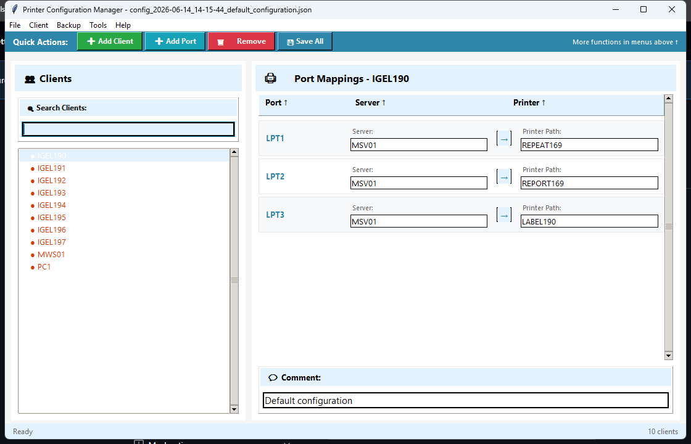
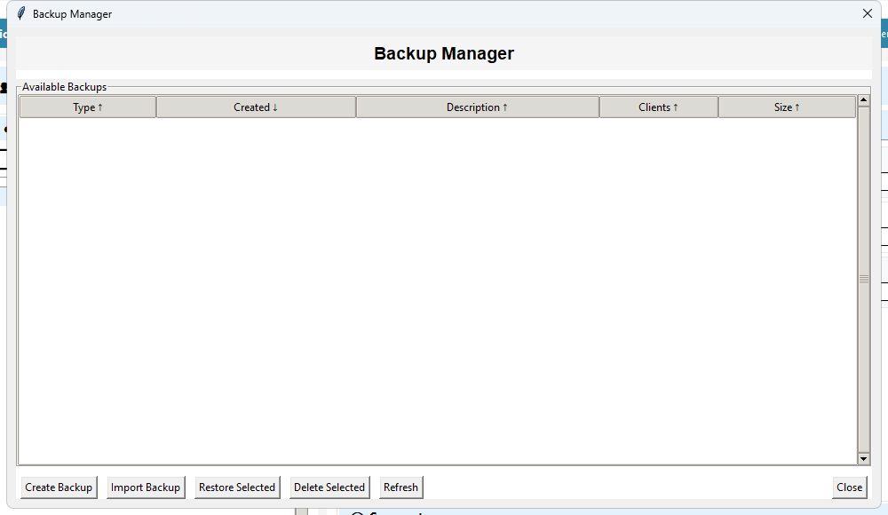
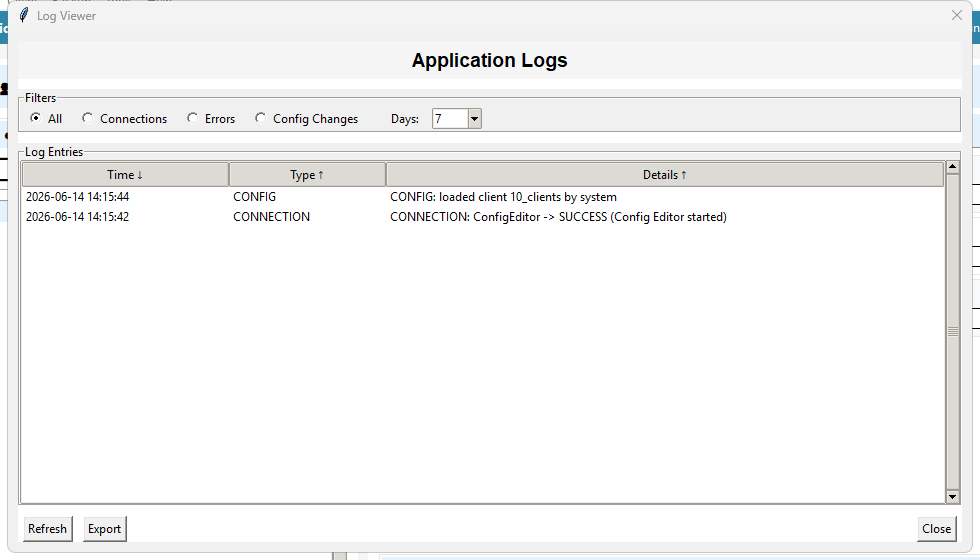

# Printer Switcher

**Automatic printer-configuration management for multi-client Windows environments.**

Printer Switcher is a Windows desktop application that manages and automatically applies
per-client printer port mappings (LPT/USB/COM to network printers). It's built for environments
where many users, workstations, or Terminal Server / RDP sessions each need a different printer
setup, and where those setups must switch the moment the active client changes, with no manual
intervention.

> **Note on this repository**
> This is a **public showcase** of the project. It documents the design, architecture, and
> feature set, and includes screenshots of the running application. The application source code
> is **proprietary and not included here**. See [LICENSE](LICENSE).

---

## Screenshots

### Configuration Editor: main window
The primary interface. A searchable client list sits on the left, per-port printer mappings on
the right, with a quick-actions toolbar and a live status bar. Status dots next to each client
reflect the background service's real-time state.



### Backup Manager
Every save creates a timestamped automatic backup. The Backup Manager lists automatic, manual,
and imported backups with metadata (type, date, description, client count, size). It supports
one-click restore, import, and cleanup.



### Log Viewer
A built-in, filterable activity log covering connections, errors, and configuration changes,
with export for troubleshooting and auditing.



---

## What it does

The product ships as **two cooperating applications**:

| Application | Role |
|---|---|
| **Config Editor** (GUI) | Create, edit, organise, back up, and audit printer configurations. |
| **Printer Switcher** (background service) | Silently watches for the active client and applies the matching printer mappings automatically. |

A configuration maps each **client** (a workstation, user, or RDP session) to a set of
**ports**, and each port to a **network printer path**:

```
Client: Reception Desk
├── LPT1  →  \\PrintServer\HP_LaserJet
├── LPT2  →  \\PrintServer\Label_Printer
└── USB001 → \\Reception\Scanner_Printer

Client: Manager Office
├── LPT1  →  \\PrintServer\Color_Printer
└── COM1  →  \\Manager\Fax_Machine
```

When a client connects, the background service detects it and writes the correct printer
mappings, so the right printers are always wired up for whoever is active.

---

## Highlights

- **Event-driven switching.** The service uses the Windows `RegNotifyChangeKeyValue` API for
  sub-100 ms detection of the active client in Terminal Server / RDP environments, instead of
  constant polling. It falls back to polling if the API is unavailable. See
  [Architecture](docs/ARCHITECTURE.md#registry-monitoring).
- **Two operating modes.** *Client mode* tracks the active RDP/Terminal Server client via the
  registry. *Local mode* uses the computer name for standalone workstations.
- **Safe by default.** Automatic timestamped backups on every save, plus manual and imported
  backups, all restorable from a dedicated Backup Manager.
- **Full audit trail.** A centralised logging system records lifecycle events, connections,
  configuration changes, and errors, viewable and exportable in-app.
- **Professional desktop UX.** Menu-driven file management (New/Open/Save/Save As), real-time
  client search, sortable columns, inline editing, right-click context menus, and keyboard
  shortcuts.
- **Zero install footprint.** Distributed as standalone Windows executables, with no runtime or
  dependencies to install on target machines.

A complete feature breakdown is in **[docs/FEATURES.md](docs/FEATURES.md)**.

---

## Tech stack

| Area | Technology |
|---|---|
| Language | Python 3.11+ |
| GUI | Tkinter |
| Windows integration | `ctypes` / `ctypes.wintypes` against the Win32 API (registry monitoring, printer mapping) |
| Concurrency | `threading` (background monitor thread, thread-safe event signalling) |
| Persistence | JSON configuration & backup files |
| Packaging | PyInstaller (single-file `.exe` per application) |
| Platform | Windows 10 / 11 (Vista+ for the registry-notification API) |

---

## Architecture at a glance

The codebase is organised into clear layers (entry points, business logic, and UI), with the
service and the editor sharing a common core:

```
main/    Application entry points (GUI editor + background service)
core/    Business logic: configuration, printer mapping, registry monitoring,
         backups, validation, logging  (no UI dependencies)
ui/      Tkinter interface: main window, panels, dialogs, styling
```

Business logic is kept decoupled from the UI, so the same services power both the interactive
editor and the headless switching service. The full component map, the event-driven monitoring
design, and the data model are documented in **[docs/ARCHITECTURE.md](docs/ARCHITECTURE.md)**.

---

## Status

- **Version:** Official Release v1.1
- **Compatibility:** Windows 10 / 11
- **License:** Proprietary. Source not distributed (see [LICENSE](LICENSE)).

---

<sub>This repository is a portfolio showcase.</sub>
